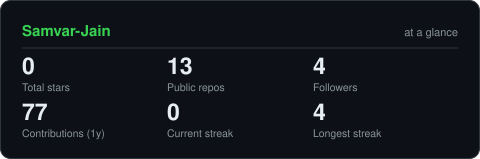
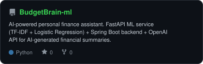
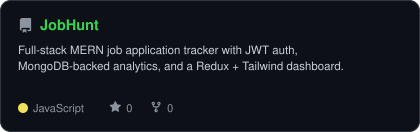
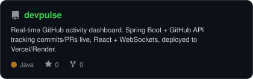

<!-- TYPING BANNER -->

 

<!-- PORTRAIT - generated by scripts/dotify.py from me.png (background removed,
     saved with transparency). Regenerate with:
       python scripts/dotify.py me.png -o assets/portrait --cols 100 \
         --equalize --detail 0.5 --color --reveal --reveal-fade 0.45 -->

 

<!-- SOCIALS -->

<!-- VIEW COUNTER -->

---

### About me

Hi, I'm **Samvar Jain**. I'm a final-year B.Tech CSE student who builds AI-powered and
full-stack systems — from agentic pipelines to production backends.

- Currently **Product Manager at Orbitron Labs**, building an AI grievance-management platform (LLMs, RAG, multi-agent workflows, OCR, multimodal AI)
- AWS Certified Solutions Architect – Associate, with AI/ML training from **IIT Mandi**
- Recently shipped **[BudgetBrain](https://github.com/Samvar-Jain/BudgetBrain)** — an AI-powered personal finance assistant with a FastAPI ML service + Spring Boot backend
- Always exploring the edge of agentic AI, LangGraph, and multi-agent systems

### Toolbox

---

### Skill radar

<table>
<tr>
<td width="50%" align="center" valign="middle">

<!-- Self-rated radar - edit assets/skills.json, the workflow redraws it -->
<picture>
  <source media="(prefers-color-scheme: dark)"  srcset="assets/radar-dark.svg">
  <source media="(prefers-color-scheme: light)" srcset="assets/radar-light.svg">
  
</picture>

</td>
<td width="50%" align="center" valign="middle">

<!-- Live radar built from real language byte counts across your repos -->
<picture>
  <source media="(prefers-color-scheme: dark)"  srcset="assets/radar-langs-dark.svg">
  <source media="(prefers-color-scheme: light)" srcset="assets/radar-langs-light.svg">
  
</picture>

</td>
</tr>
</table>

---

### The numbers

<!-- Stat card generated by scripts/cards.py into this repo. Deliberately NOT
     github-readme-stats / streak-stats / github-profile-trophy: those are
     shared public instances that go down and take the whole section with them. -->
<picture>
  <source media="(prefers-color-scheme: dark)"  srcset="assets/card-stats-dark.svg">
  <source media="(prefers-color-scheme: light)" srcset="assets/card-stats-light.svg">
  
</picture>

---

### Selected work

<!-- Cards generated by scripts/cards.py from assets/projects.json.
     Stars, forks and language are pulled live from the API on every run. -->
<table>
<tr>
<td width="33%">
  <a href="https://github.com/Samvar-Jain/BudgetBrain-ml">
    <picture>
      <source media="(prefers-color-scheme: dark)"  srcset="assets/card-BudgetBrain-ml-dark.svg">
      <source media="(prefers-color-scheme: light)" srcset="assets/card-BudgetBrain-ml-light.svg">
      
    </picture>
  </a>
</td>
<td width="33%">
  <a href="https://github.com/Samvar-Jain/JobHunt-Pro">
    <picture>
      <source media="(prefers-color-scheme: dark)"  srcset="assets/card-JobHunt-Pro-dark.svg">
      <source media="(prefers-color-scheme: light)" srcset="assets/card-JobHunt-Pro-light.svg">
      
    </picture>
  </a>
</td>
<td width="33%">
  <a href="https://github.com/Samvar-Jain/devpulse">
    <picture>
      <source media="(prefers-color-scheme: dark)"  srcset="assets/card-devpulse-dark.svg">
      <source media="(prefers-color-scheme: light)" srcset="assets/card-devpulse-light.svg">
      
    </picture>
  </a>
</td>
</tr>
</table>

---

<!-- Snake eats the contribution graph - .github/workflows/snake.yml pushes to an
     orphan `output` branch. 404s until that workflow's first run - expected. -->
<picture>
  <source media="(prefers-color-scheme: dark)"  srcset="https://raw.githubusercontent.com/Samvar-Jain/Samvar-Jain/output/snake-dark.svg">
  <source media="(prefers-color-scheme: light)" srcset="https://raw.githubusercontent.com/Samvar-Jain/Samvar-Jain/output/snake.svg">
  
</picture>

